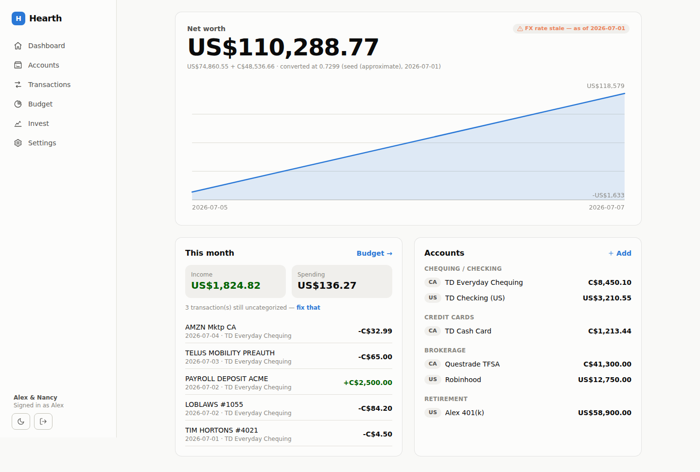

# PROGRESS

_Last updated: 2026-07-07_

## Status: M1 + M2 shipped and verified · M3 scaffolded · M4 shipped (advisor needs an API key) · M5 partially verified

The app ("Hearth") builds, runs, and survives its verification gauntlet. Screenshots in `docs/screenshots/`.



## What's done and verified

**M1 — Ledger ✅**
- Two-login household: signup creates a household + invite code; partner joins at `/join` and sees everything (verified end-to-end with a second browser context).
- Accounts across US/CA + USD/CAD, credit-card debt subtracted from net worth, manual balance snapshots with history.
- CSV import with a column-mapping UI (signed-amount or debit/credit columns, 3 date orders, sign flip), remembered per institution header signature, dedupe on re-import (re-importing the same statement is a verified no-op).
- Multi-currency net worth: native totals + converted total, FX rate/source/date always displayed; stale FX and stale balances get visible badges (house rule 1).

**M2 — Budget ✅**
- Category seeding, inline re-categorization, month navigation, budgets vs actuals with over-budget marking, uncategorized-spend callout.
- AI categorization endpoint (Claude, structured output) with an honest disabled state when `ANTHROPIC_API_KEY` is unset.

**M3 — Sync 🟡 scaffolded**
- Adapter contract (`src/lib/sync/types.ts`) + a deterministic mock adapter with `ok|fail|partial|stale` modes powering the chaos test.
- Plaid / SnapTrade / Questrade stubs report exactly what credential is missing in Settings → Connections; wiring the real SDKs in is isolated to `sync()` per adapter.

**M4 — Invest ✅ (advisor gated on API key)**
- Deterministic 90/10 engine: hard 10% pick cap (refuses more even if configured higher — unit-tested), pick sleeve funded from cashback, largest-remainder ETF allocation that sums to the cent.
- Gold Card cashback tracker at the verified **3%** brokerage-redemption rate (2.1% statement).
- Advisor memos: Claude + web search, cited data, immutable append-only log with accept/decline + outcome notes feeding future memos.

**M5 — Polish 🟡**
- Responsive at 390px (bottom nav) and desktop (sidebar); light + dark themes with pre-paint theme script; validated chart palette; empty/error/stale states throughout; JSON + CSV export.

## Verification evidence (this session)

| Check | Result |
|---|---|
| Unit tests (money math, 90/10, cashback, CSV dedupe/mapping) | 16/16 pass |
| Nancy test (fresh context: signup→join→see accounts) | pass (scripted browser) |
| Reconciliation test | pass — net worth matches independent ground truth to the cent (US$110,288.77), incl. FX conversion + credit subtraction |
| Duplicate re-import | pass — 5/5 rows skipped |
| Chaos test (`HEARTH_MOCK_MODE=fail\|partial\|stale`) | pass — error surfaced, PARTIAL noted, STALE marked on accounts |
| Real-life loop (signup→6 accounts→CSV→categorize→budget→invest→export→partner join→mobile→dark) | pass, zero console errors |

**Bugs found and fixed by verification:** (1) empty net-worth history crashed the chart (`toFixed` on undefined); (2) the seed FX rate ignored direction — CAD was *multiplied* by 1.37 instead of divided, inflating net worth by ~$31k. Both now covered by the E2E assertions.

## What's left (next session picks up here)

1. **Real sync adapters** — implement `sync()` for Plaid (TD US + TD Canada), SnapTrade (Robinhood/Wealthsimple/Questrade/Fidelity), Questrade personal API. Requires the couple's API keys; everything else is in place.
2. **Fresh-context adversarial verification** per PROMPT.md §6 — this session's checks were scripted by the builder; the stranger test (side-by-side vs Monarch screenshots) and an independent Nancy-test agent should run before calling §5 fully cleared.
3. FX rate caching hardening (currently refetches on first conversion of the day; blocked-network envs fall back to the labeled seed rate).
4. Advisor memo streaming/progress UX (memos take ~30–60s; currently a pending button state).

## Run it

```bash
npm install
npm run build && npm start        # or: npm run dev
# optional:
#   ANTHROPIC_API_KEY=...         # enables AI categorization + advisor memos
#   SESSION_SECRET=...            # required in production
#   DATA_DIR=/path/to/volume      # SQLite location (default ./data)
#   HEARTH_ENABLE_MOCK=1          # demo sync connection
npx vitest run                    # unit tests
```
